# CABAC Subsystem Block Diagram

This diagram documents the current RTL CABAC subsystem boundaries. It shows the stream contracts used today and the places where the implementation is intentionally still evolving toward a fully sequential, syntax-driven CABAC encoder.

```mermaid
flowchart LR
    subgraph Upstream[Upstream syntax producers]
        CTU[ff_vvc_ctu_symbolizer\nCTU/CU syntax symbols]
        PALSYM[ff_vvc_palette_symbolizer\n4:4:4 palette symbols]
    end

    subgraph TOP[ff_vvc_cabac]
        subgraph STREAM[ff_vvc_cabac_pipeline]
            FE[ff_vvc_cabac_syntax_frontend\nresidual pass-through + palette packet expansion\nfuture CTU descriptor expansion]
            BIN[ff_vvc_cabac_symbol_binarizer\nsymbol kind/data -> CABAC bin records]
            WR[ff_vvc_cabac_stream_writer\nCABAC arithmetic state + byte emission]
            CTX[ff_vvc_cabac_context_model\ncontext init/query/update]
            ENG[ff_vvc_cabac_bin_engine\nlow/range renormalization step]
            BW[ff_vvc_cabac_bit_writer\nbyte-aligned output staging]
        end

    end

    subgraph Downstream[Downstream bitstream wrapping]
        RBSP[ff_vvc_rbsp_payload_stream\nRBSP trailing bits]
        EP[ff_vvc_emulation_prevention_stream\nemulation-prevention bytes]
        NAL[ff_vvc_annexb_slice_stream\nAnnex B slice NAL]
    end

    CTU -- residual/CU symbols --> FE
    PALSYM -- palette packets --> FE
    FE -- syntax symbols --> BIN
    BIN -- bin kind, ctx id, bin value, EP pattern --> WR
    WR -- ctx query/update --> CTX
    CTX -- lps/mps --> WR
    WR -- selected bin + lps/mps + low/range --> ENG
    ENG -- next low/range/bits_left/write_out --> WR
    WR -- emitted bit groups --> BW
    BW -- CABAC bytes + last-byte-bit count --> RBSP

    RBSP --> EP --> NAL
```

## Stream Interfaces

The CABAC top-level contract is intentionally a streamer interface:

- Input: `s_axis_valid`, `s_axis_ready`, `s_axis_kind`, `s_axis_data`, `s_axis_last`.
- Output: `m_axis_valid`, `m_axis_ready`, `m_axis_data`, `m_axis_last`, `stream_last_byte_bits`.
- `s_axis_kind` carries either normalized CABAC symbols or palette packet kinds. Palette packet kinds use the `8'h8*` namespace and are expanded by `ff_vvc_cabac_syntax_frontend`.
- Context-coded symbols carry a 10-bit context ID in `s_axis_data[17:8]`; this is intentionally wider than the current subset so the stream ABI can cover the full VVC context namespace later.

## Current Responsibilities

- `ff_vvc_ctu_symbolizer` generates VVC CTU/CU syntax symbols for the current residual path, including split flags, intra mode symbols, CBFs, residual DC symbols, and termination. Its interface carries `chroma_format_idc`; the current chroma residual subtree remains the audited 4:2:0 implementation until 4:2:2/4:4:4 residual syntax is added.
- `ff_vvc_cabac_syntax_frontend` passes normalized residual symbols through and expands current palette packets into common CABAC symbols. Its CTU descriptor inputs are present so more syntax expansion can move inside the CABAC subsystem later.
- `ff_vvc_cabac_symbol_binarizer` translates the raw symbol encoding into normalized CABAC bin records.
- `ff_vvc_cabac_stream_writer` owns the arithmetic encoder state and emits bytes as they become available.
- `ff_vvc_cabac_context_model` stores and updates the VVC context states.
- `ff_vvc_cabac_bin_engine` performs the combinational low/range update for one bin.
- `ff_vvc_cabac_bit_writer` serializes emitted bit groups into output bytes.
- Keep moving palette syntax from compact palette packets toward spec-complete `cu_palette_info()` symbol generation in the common frontend/binarizer path.

## Near-Term Cleanup Targets

- Move CTU syntax expansion from `ff_vvc_ctu_symbolizer`/raw symbol streams into a proper CABAC syntax frontend where appropriate.
- Complete palette index-map expansion in the common syntax frontend/binarizer path; the separate palette CABAC writer has been removed.
- Keep all paths using streaming handshakes; avoid reintroducing whole-payload buffers or geometry-specific payload tables.
